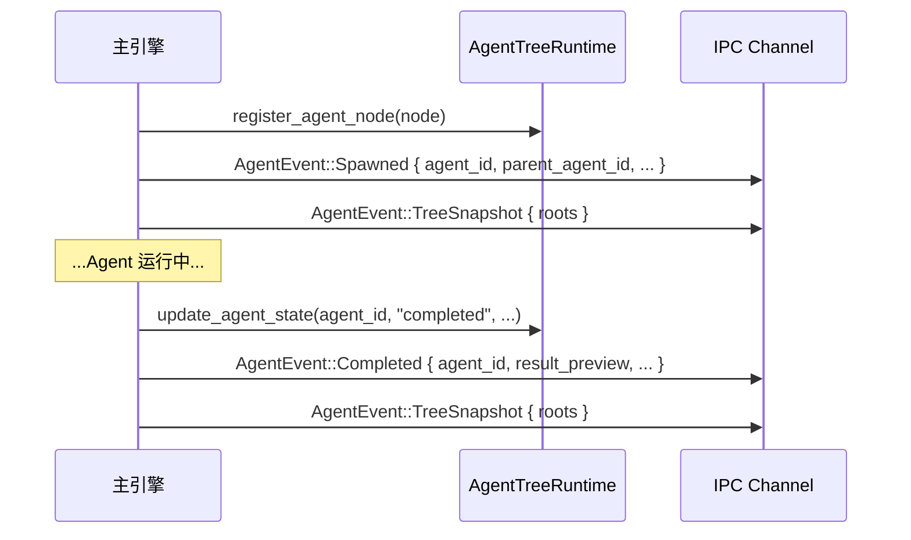
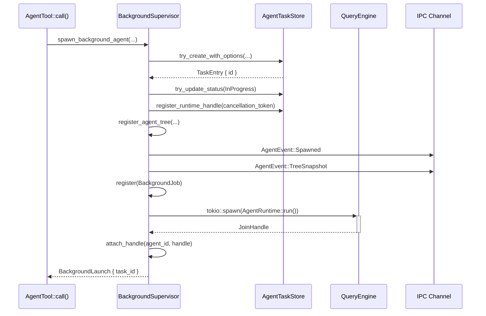

## 架构总览

allthecodes 的多 Agent 协作体系分为三个层面：

1. **AgentRuntime 适配器层** — 可插拔的桥接接口，将 Agent 引擎与上层（UI、Dashboard、任务存储）解耦
2. **Agent 树形生命周期层** — 以父子层级管理所有活跃 Agent，通过 AgentNode 构成森林结构
3. **后台 Supervisor 层** — 独立管理后台 Agent 的生命周期、取消、清理和 Worktree 管理

这三种机制共同构成了从单一 Agent 到多 Agent 协作的完整基础。

## AgentRuntime 适配器体系

Agent 引擎通过 `AgentRuntimeAdapters` 结构体暴露一组可注入的接口，定义在 `crates/allthecodes-engine/src/agent_runtime.rs`：

```rust
pub struct AgentRuntimeAdapters {
    pub dashboard: Arc<dyn DashboardEmitter>,         // 事件仪表盘
    pub builtin_agents: Arc<dyn BuiltinAgentRegistry>, // 内置 Agent 注册表
    pub tools: Arc<dyn AgentToolRegistry>,            // 工具注册表
    pub teammate_spawner: Arc<dyn TeammateSpawner>,   // Teammate 生成器
    pub task_store: Arc<dyn AgentTaskStore>,           // 任务持久化
    pub agent_tree: Arc<dyn AgentTreeRuntime>,         // Agent 树运行态
}
```

这些适配器通过全局 `OnceLock<RwLock<AgentRuntimeAdapters>>` 注册，在引擎初始化时由主程序注入。这使得 Agent 引擎不依赖特定的 UI 框架或任务存储实现——测试和产品环境通过不同的适配器实现获得不同行为。

### DashboardEmitter

仪表盘发射器负责广播 Agent 生命周期事件，包括 `spawn`、`complete`、`error`、`warning`、`worktree_created`、`worktree_kept`、`worktree_cleaned` 等事件类型。每个事件携带 agent_id、parent_agent_id、描述、模型、深度、后台标志和可选的 JSON 负载。默认实现（NoopDashboardEmitter）在生产中会被替换为真实的 IPC 广播器。

### AgentTaskStore

任务存储接口实现了完整的任务持久化原语：

- `try_create_with_options` — 创建带选项的任务条目（类型、父 ID、依赖、隔离模式、worktree 路径等）
- `try_update_status` — 原子更新任务状态
- `register_runtime_handle` / `unregister_runtime_handle` — 注册取消令牌
- `append_output` — 持续追加任务输出
- `try_stop` — 停止任务
- `get_by_agent_id` — 按 agent_id 查询任务
- `unassign_teammate_tasks` — Teammate 退出时重新分配任务

### AgentTreeRuntime

Agent 树运行态维护所有活跃 Agent 的层级关系。实现为 `InMemoryAgentTreeRuntime`，内部使用 `HashMap<String, AgentNode>` 存储所有节点，并提供 `snapshot()` 方法构建以根节点为起点的完整子树。关键方法：

```rust
pub trait AgentTreeRuntime: Send + Sync {
    fn register(&self, node: AgentNode);       // 注册新 Agent
    fn update_state(&self, agent_id, state, ...); // 更新 Agent 状态
    fn snapshot(&self) -> Vec<AgentNode>;       // 获取完整森林快照
    fn active_count(&self) -> usize;            // 活跃 Agent 计数
}
```

## Agent 树形生命周期

Agent 节点（`AgentNode`）携带完整的层级信息：

```rust
pub struct AgentNode {
    pub agent_id: String,
    pub parent_agent_id: Option<String>,
    pub description: String,
    pub agent_type: Option<String>,
    pub model: Option<String>,
    pub state: String,            // running / completed / error / cancelled
    pub is_background: bool,
    pub depth: usize,
    pub chain_id: String,
    pub spawned_at: i64,
    pub completed_at: Option<i64>,
    pub duration_ms: Option<u64>,
    pub result_preview: Option<String>,
    pub had_error: bool,
    pub children: Vec<AgentNode>, // 递归填充的子节点
}
```

每当一个子 Agent spawn 时，引擎会调用 `register_agent_node()` 将节点注册到全局树中。同时通过 IPC 发送 `Spawned` 和 `TreeSnapshot` 事件到前端，使 UI 能够实时展示 Agent 层级。

Agent 完成后，引擎更新节点状态并发送 `Completed` 事件加上新的 `TreeSnapshot`。



## 后台 Supervisor

后台 Agent 由 `BackgroundSupervisor` 统一管理，定义在 `crates/allthecodes-engine/src/agent/supervisor.rs`。它是一个全局单例（`LazyLock<BackgroundSupervisor>`），内部维护一个 `HashMap<String, BackgroundJob>`。

### BackgroundJob 结构

```rust
struct BackgroundJob {
    agent_id: String,
    task_id: String,
    cancellation_token: CancellationToken,
    handle: Option<tokio::task::JoinHandle<()>>,
    worktree: Option<WorktreeRuntime>,
}
```

### 后台 Agent 启动流程

`spawn_background_agent()` 的完整调用链：



### AgentRuntime::run() 后台循环

后台 Agent 在独立的 `tokio::spawn` 任务中运行。核心循环使用 `tokio::select!` 同时监听两个信号：

```rust
loop {
    let msg = tokio::select! {
        _ = self.cancellation_token.cancelled() => {
            child_engine.abort();
            was_cancelled = true;
            break;
        }
        msg = stream.next() => msg,
    };
    // ... 处理消息并转发 IPC 事件 ...
}
```

- 取消令牌触发时，立即调用 `child_engine.abort()` 中断 QueryEngine
- 正常流结束时，收集结果文本

完成后，后台循环依次执行：

1. 将结果文本追加到 TaskStore
2. 更新任务状态（Completed / Failed / Cancelled）
3. 取消注册运行时句柄
4. 从 BackgroundSupervisor 移除
5. 发送 `background_complete` 子 Agent 事件
6. 触发 SubagentStop hook
7. 更新 Agent 树状态并发送 `Completed` + `TreeSnapshot` IPC 事件
8. 处理 worktree 清理或保留

### 优雅关闭

`shutdown_all()` 提供统一的关闭入口，接收一个原因字符串：

- 获取所有活跃任务快照
- 依次取消每个任务的 CancellationToken
- 追加关闭原因到任务输出
- 调用 `try_stop()` 记录任务终止
- 等待每个 JoinHandle，超时 5 秒后强制 abort
- 超时未停止的后台 Agent 会进行 worktree 强制清理

## Teammate 生成与蜂群协作

当 `AgentTool::call()` 检测到输入参数中包含 `name` 字段时，路由到 teammate spawn 路径：

```rust
if let Some(spawn_request) = teammate_spawn_request(&params, &(ctx.get_app_state)())? {
    // ... 解析 model、team_name ...
    crate::agent_runtime::spawn_teammate(spawn_input, ctx, ...)
}
```

### TeammateSpawner

`TeammateSpawner` trait 抽象了 teammate 的生成机制：

```rust
#[async_trait]
pub trait TeammateSpawner: Send + Sync {
    async fn spawn(&self, input, ctx, parent, on_progress) -> Result<ToolResult>;
}
```

默认的 `NoopTeammateSpawner` 返回错误；产品实现由主程序通过 `set_agent_runtime_adapters()` 注入。

### 嵌套保护

teammate 生成有严格的嵌套限制——只有 Team Lead 可以 spawn teammate，普通 teammate 不能再次 spawn：

```rust
if !allthecodes_types::teams::is_team_lead(Some(team_context)) {
    bail!("Teammates cannot spawn other teammates; omit `name` to create a normal subagent");
}
```

Teammate spawn 的结果会被 `annotate_agent_teammate_result()` 修饰，添加 `status: "teammate_spawned"`、`teammate_id`、`team_name` 等字段。

## Agent 深度限制

为防止无限递归 spawn，引擎设定了 `MAX_AGENT_DEPTH = 5` 的硬编码上限。在 `AgentTool::call()` 的开头进行检查：

```rust
let current_depth = ctx.query_tracking.as_ref().map(|t| t.depth).unwrap_or(0);
if current_depth >= MAX_AGENT_DEPTH {
    bail!("Agent recursion depth limit reached ({}/{})", current_depth, MAX_AGENT_DEPTH);
}
```

深度信息通过 `AgentContext` 传递到子引擎的 `QueryChainTracking` 结构中。

## 关键源码路径

| 组件 | 文件 | 作用 |
|------|------|------|
| AgentRuntime 适配器 | `crates/allthecodes-engine/src/agent_runtime.rs` | 接口定义、全局适配器注册、辅助函数 |
| Agent 树实现 | `crates/allthecodes-engine/src/agent_runtime.rs` | InMemoryAgentTreeRuntime、AgentTreeState |
| 后台 Supervisor | `crates/allthecodes-engine/src/agent/supervisor.rs` | BackgroundSupervisor、AgentRuntime::run()、shutdown_all |
| Agent 工具入口 | `crates/allthecodes-engine/src/agent/tool_impl.rs` | Tool trait 实现、深度检查、teammate 路由 |
| Agent 事件类型 | `crates/allthecodes-types/src/agent_events.rs` | AgentEvent/AgentCommand 枚举定义 |
| Agent 节点类型 | `crates/allthecodes-types/src/agent_types.rs` | AgentNode 结构体 |
| 任务存储接口 | `crates/allthecodes-tasks/src/` | TaskStore、TaskEntry、TaskStatus |
