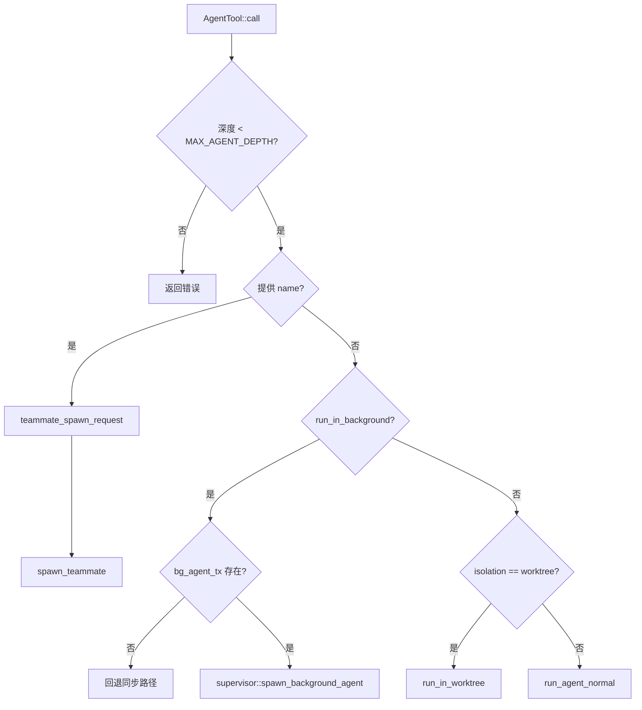
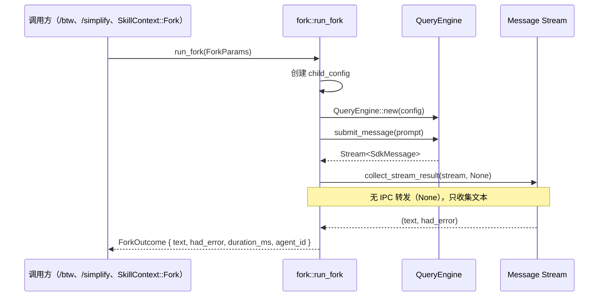

## 四种子 Agent 执行路径

allthecodes 中的子 Agent 有四种不同的执行路径：

| 路径 | 入口 | 是否经过 Tool 协议 | 结果返回方式 | 典型用途 |
|------|------|-------------------|-------------|----------|
| AgentTool 子 Agent | `AgentTool::call()` | 是 | `ToolResult` 直接返回 | 标准 Agent 委派 |
| Fork 轻量级执行 | `fork::run_fork()` | 否，内部 API | `ForkOutcome { text, had_error }` | `/btw`、`/simplify`、Skill Fork |
| 后台子 Agent | `supervisor::spawn_background_agent()` | 通过 AgentTool 进入 | TaskStore + IPC 事件 | 长期后台任务 |
| Teammate spawn | `agent_runtime::spawn_teammate()` | 通过 AgentTool 进入 | ToolResult + 团队事件 | Agent Teams 蜂群 |

## AgentTool 主执行链路

`AgentTool` 实现 `Tool` trait，其 `call()` 方法是所有子 Agent 路由的统一入口。文件位于 `crates/allthecodes-engine/src/agent/tool_impl.rs`。

### 输入参数

```rust
struct AgentInput {
    prompt: String,                    // 子 Agent 的任务说明
    description: Option<String>,       // 3-5 词的任务摘要
    subagent_type: Option<String>,     // Agent 类型（general-purpose, Explore, Plan 等）
    model: Option<String>,             // 模型覆盖
    run_in_background: bool,           // 是否后台运行
    name: Option<String>,              // Teammate 名称（触发 teammate spawn）
    team_name: Option<String>,         // 团队名称
    mode: Option<String>,              // 权限模式
    isolation: Option<String>,         // 隔离模式（"worktree"）
}
```

### 路由决策树



### 同步执行流程

同步路径 `run_agent_normal()` 创建子 `QueryEngine` 并直接等待结果：

```rust
let mut child_engine = QueryEngine::new(child_config);
child_engine.set_hook_runner(ctx.hook_runner.clone());
child_engine.set_command_dispatcher(ctx.command_dispatcher.clone());
let stream = child_engine.submit_message(&params.prompt, QuerySource::Agent(agent_id));
let (result_text, had_error) = collect_stream_result(stream, ipc).await;
```

`collect_stream_result()` 会消费子引擎的整个消息流，收集最终的文本输出，并在有 IPC 发送器时将中间事件转发到前端。

### Agent Definition 默认值

`apply_agent_definition_defaults()` 将 Agent Definition 中的默认值应用到调用参数上：

- `model` — 当调用参数未指定时使用 definition 中的模型
- `background` — definition 中 `background: true` 时强制后台运行
- `isolation` — 从 definition 中继承隔离模式
- `mode` — 以父权限模式为基础，组合 definition 中的权限模式

权限组合由 `compose_agent_permission_mode()` 决定：

```rust
pub(super) fn compose_agent_permission_mode(parent, requested) -> PermissionMode {
    match parent {
        // 非 Default 模式时，父模式优先（子 Agent 不能绕过父限制）
        Auto | Bypass | AcceptEdits | Plan | DontAsk => parent.clone(),
        // Default 模式时，子 Agent 可以设置自己的权限
        Default => requested.map(...).unwrap_or(PermissionMode::Default),
    }
}
```

## Fork 轻量级执行

Fork 路径对应 `crates/allthecodes-engine/src/agent/fork.rs`，是一个轻量级的子引擎调用接口，不经过 Agent 树注册、不触发 SubagentStart/SubagentStop hook、不通过 IPC 流式事件。

### ForkParams

```rust
pub struct ForkParams {
    pub prompt: String,
    pub cwd: String,
    pub model: String,
    pub fallback_model: Option<String>,
    pub tools: Tools,                    // 可用工具，空 Vec 表示无工具
    pub max_turns: Option<usize>,        // 默认 1（无工具使用时）
    pub parent_messages: Option<Vec<Message>>, // 父消息历史（prompt cache 复用）
    pub append_system_prompt: Option<String>,
    pub custom_system_prompt: Option<String>,
    pub hook_runner: Arc<dyn HookRunner>,
    pub command_dispatcher: Arc<dyn CommandDispatcher>,
}
```

### ForkOutcome

```rust
pub struct ForkOutcome {
    pub text: String,
    pub had_error: bool,
    pub duration_ms: u64,
    pub agent_id: String,
}
```

### 执行逻辑



fork 的关键特性：

- **生命周期短暂**：默认 `max_turns = 1`，适合单轮问答
- **无持久化**：`persist_session = false`、`auto_save_session = false`
- **Prompt Cache 复用**：通过 `parent_messages` 传入父对话历史，子引擎共享初始消息以获得缓存命中
- **无树注册**：不调用 `register_agent_node()`，不产生 IPC AgentEvent

### 使用场景

| 场景 | 工具集 | max_turns | 说明 |
|------|--------|-----------|------|
| `/btw` 侧问 | 空（无工具） | 1 | 纯文本推理，不访问文件系统 |
| `/simplify` 多 Agent 审查 | 有限读写工具 | 少量 | 隔离审查 |
| `SkillContext::Fork` | 按 skill 定义 | 按需 | 隔离运行 skill prompt |

## Agent 事件与 IPC 通信

Agent 引擎通过 IPC 通道向前端发送实时事件，定义在 `crates/allthecodes-types/src/agent_events.rs`。

### 后端 → 前端事件（AgentEvent）

| 事件 | 触发时机 | 关键字段 |
|------|---------|---------|
| `Spawned` | Agent 启动时 | agent_id, parent_agent_id, description, agent_type, model, is_background, depth, chain_id |
| `Completed` | Agent 正常完成 | agent_id, result_preview, had_error, duration_ms, output_tokens |
| `Error` | Agent 异常终止 | agent_id, error, duration_ms |
| `Aborted` | Agent 被取消 | agent_id |
| `StreamDelta` | 流式文本增量 | agent_id, text |
| `ThinkingDelta` | 思考过程增量 | agent_id, thinking |
| `ToolUse` | Agent 调用工具时 | agent_id, tool_use_id, tool_name, input |
| `ToolResult` | Agent 收到工具结果 | agent_id, tool_use_id, output, is_error |
| `PermissionQueued` | 权限请求入队 | agent_id, tool_use_id, tool_name, summary, queue_position, pending_count |
| `PermissionResolved` | 权限请求已处理 | agent_id, tool_use_id, tool_name, decision, pending_count |
| `TreeSnapshot` | Agent 树变化时 | roots: Vec<AgentNode> |

### 事件转换

`sdk_to_agent_event()` 函数将 `SdkMessage`（引擎的标准输出消息）转换为 `AgentEvent`：

```rust
pub(crate) fn sdk_to_agent_event(sdk_msg, agent_id) -> Option<AgentEvent> {
    match sdk_msg {
        StreamEvent(ContentBlockDelta { text }) => Some(StreamDelta { agent_id, text }),
        Assistant(ToolUse { id, name, input }) => Some(ToolUse { agent_id, tool_use_id, tool_name, input }),
        UserReplay(ToolResult { ... }) => Some(ToolResult { agent_id, ... }),
        _ => None,
    }
}
```

### 前端 → 后端命令（AgentCommand）

| 命令 | 作用 |
|------|------|
| `AbortAgent { agent_id }` | 请求中止指定 Agent |
| `QueryActiveAgents` | 查询当前所有活跃 Agent |
| `QueryAgentOutput { agent_id }` | 查询 Agent 的输出 |

## 深度追踪与链式 ID

每个 Agent 在启动时获得一个全局唯一的 `chain_id` 和基于深度的层级定位：

```rust
let chain_id = ctx.query_tracking
    .as_ref()
    .map(|t| t.chain_id.clone())
    .unwrap_or_else(|| Uuid::new_v4().to_string());

let child_context = AgentContext {
    agent_id: agent_id.to_string(),
    query_tracking: QueryChainTracking {
        chain_id,
        depth: current_depth + 1,  // 每层递增
    },
    // ...
};
```

这使得所有子 Agent 共享同一个 `chain_id`，便于会话恢复和日志追踪。

## 内置 Agent 类型

allthecodes 注册了 6 个内置 Agent，定义在 `crates/allthecodes-engine/src/agent/builtin_agents.rs`：

| Agent 类型 | 可用工具 | 颜色 | 用途 |
|-----------|---------|------|------|
| general-purpose | 全部工具 | 无 | 通用用途 |
| Explore | Glob, Grep, Read | cyan | 代码库探索 |
| Plan | Glob, Grep, Read | purple | 实现规划 |
| code-reviewer | Glob, Grep, Read | orange | 代码审查 |
| worker | Glob, Grep, Read, Bash, Edit, Write, TodoWrite, TaskList, TaskUpdate, SendMessage | green | Coordinator 模式的 Worker |
| statusline-setup | Read, Edit, Write, Bash | yellow | 状态行配置 |

Agent 定义通过 `AgentDefinitionEntry` 结构体暴露给运行时：

```rust
pub struct AgentDefinitionEntry {
    pub name: String, pub description: String, pub system_prompt: String,
    pub tools: Vec<String>, pub disallowed_tools: Vec<String>,
    pub model: Option<String>, pub color: Option<String>,
    pub permission_mode: Option<AgentPermissionMode>,
    pub memory: Option<String>, pub max_turns: Option<i32>,
    pub effort: Option<String>, pub background: bool,
    pub isolation: Option<String>, pub skills: Vec<String>,
    // ... hooks, mcp_servers, initial_prompt
}
```

## 关键源码路径

| 组件 | 文件 | 作用 |
|------|------|------|
| AgentTool 输入与核心 | `crates/allthecodes-engine/src/agent/mod.rs` | AgentInput 结构体、深度常量、工具过滤、子配置构建 |
| AgentTool Tool 实现 | `crates/allthecodes-engine/src/agent/tool_impl.rs` | call()、路由、teammate、默认值应用 |
| 同步/工作目录分发 | `crates/allthecodes-engine/src/agent/dispatch.rs` | run_agent_dispatch、run_agent_normal、Hook 触发 |
| Fork 执行器 | `crates/allthecodes-engine/src/agent/fork.rs` | ForkParams、ForkOutcome、run_fork |
| 内置 Agent 定义 | `crates/allthecodes-engine/src/agent/builtin_agents.rs` | 6 个内置 Agent 的 system prompt 和工具边界 |
| Agent 事件类型 | `crates/allthecodes-types/src/agent_events.rs` | AgentEvent/AgentCommand 枚举 |
| IPC 协议 | `crates/allthecodes-ipc-protocol/src/` | 子系统类型定义 |
