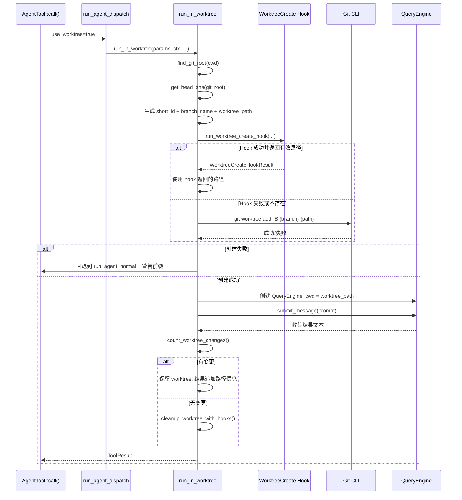
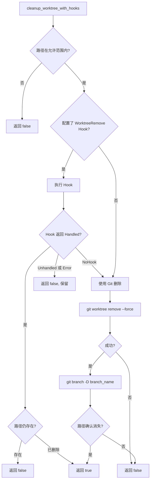

## 为什么需要文件级隔离

在统一工作目录中运行多个子 Agent 会导致三类问题：

1. **写入冲突** — Agent A 修改 `config.rs` 时，Agent B 也在修改同一文件
2. **状态干扰** — Agent A 的测试依赖特定环境状态，Agent B 的修改破坏了它
3. **变更归属不明** — 半完成的修改混在一起，无法追溯来源

Git Worktree 是 Git 原生的解决方案——在同一仓库中创建多个独立工作目录，每个目录可以 checkout 不同分支或共享同一分支，但文件系统视图完全独立。

## 两种 Worktree 路径

allthecodes 中区分两种 worktree 类型，定义在 `crates/allthecodes-engine/src/worktree_hooks.rs`：

### 用户级 Worktree

用户通过 `EnterWorktreeTool` 创建的 worktree，用于人工操作隔离：

```rust
pub fn default_user_worktree_path(slug: &str) -> PathBuf {
    crate::config::paths::worktrees_dir().join(format!("cc-worktree-{}", slug))
}
// 分支名: cc-worktree-{slug}
```

### Agent 级 Worktree

子 Agent 通过 `isolation: "worktree"` 参数自动创建的 worktree，代码自动管理生命周期：

```rust
pub fn default_agent_worktree_path(short_id: &str) -> PathBuf {
    crate::config::paths::worktrees_dir().join(format!("agent-worktree-{}", short_id))
}
// 分支名: agent-worktree-{8 位短 ID}
```

所有 worktree 统一存储在 `<worktrees_dir>/` 目录下。该路径通过 `validate_allowed_worktree_path()` 进行安全校验，确保 worktree 路径不会逃逸到允许范围之外。

## 子 Agent Worktree 生命周期

子 Agent 的 worktree 创建和管理实现在 `crates/allthecodes-engine/src/agent/worktree.rs` 中。

### 调用入口

当 `AgentTool::call()` 检测到 `isolation: "worktree"` 时，路由到 `run_agent_dispatch()`，后者根据 `use_worktree` 标志调用 `run_in_worktree()`。

### 完整创建流程



### 分支创建

Agent worktree 使用 `git worktree add -B` 命令创建或重置到指定分支：

```rust
let wt_output = tokio::process::Command::new("git")
    .args(["-C", &git_root.to_string_lossy(),
        "worktree", "add", "-B", &branch_name,
        &worktree_path.to_string_lossy()])
    .output()
    .await;
```

`-B` 标志确保即使分支已存在也会强制重置，避免冲突。

### 变更检测与清理决策

子 Agent 完成后，`count_worktree_changes()` 通过两个维度检测变更：

1. **未提交文件变更** — `git status --porcelain` 输出行数
2. **新提交数** — `git rev-list --count {original_head}..HEAD`

决策逻辑：

```rust
let has_changes = match changes {
    Some((files, commits)) => files > 0 || commits > 0,
    None => true, // fail-closed: 无法确定时假设有变更
};
```

- **有变更** → 保留 worktree，在结果文本中追加路径和分支信息
- **无变更** → `cleanup_worktree_with_hooks()` 清理 worktree 目录和分支
- **无法确定** → fail-closed，保留 worktree

### 清理流程

`cleanup_worktree_with_hooks()` 方法执行清理：



关键的自保护机制：

```rust
// 路径安全校验
if let Err(err) = validate_allowed_worktree_path(worktree_path) {
    warn!("worktree cleanup refused for out-of-bounds path");
    return false;
}
```

## 后台 Agent 的 Worktree

后台 Agent 的 worktree 管理在 `supervisor.rs` 的 `prepare_runtime()` 中处理：

```rust
async fn prepare_runtime(use_worktree, agent_id, ...) -> Result<PreparedRuntime> {
    if !use_worktree {
        return Ok(PreparedRuntime { child_cwd: current_dir, worktree: None, ... });
    }
    // 尝试创建工作目录 worktree
    match prepare_worktree_runtime(...).await {
        Ok(runtime) => Ok(runtime),
        Err(err) => {
            if !worktree_fallback_enabled() {
                bail!("background worktree isolation required but setup failed: {err}");
            }
            // 降级到普通目录，但附加启动警告
            Ok(PreparedRuntime { startup_warning: Some(warning), ... })
        }
    }
}
```

### 降级策略

- 环境变量 `ALLTHECODES_ALLOW_WORKTREE_FALLBACK=true` 控制是否允许降级
- 降级时 worktree 创建失败不会阻止后台 Agent 启动
- Agent 结果文本会以 `[WARNING: worktree isolation skipped ...]` 开头

### 强制关闭后的清理

当后台 Agent 超时未停止时，`finalize_or_keep_worktree_after_forced_shutdown()` 处理最后清理：

```
flowchart TD
    A[shutdown_all 超时] --> B[abort JoinHandle]
    B --> C[finalize_or_keep_worktree_after_forced_shutdown]
    C --> D{有变更?}
    D -->|是| E[保留 worktree, 追加信息到 task output]
    D -->|否| F[尝试 cleanup_worktree_with_hooks]
    F --> G{清理成功?}
    G -->|是| H[追加清理成功信息]
    G -->|否| I[保留 + 追加清理失败信息]
```

## Session 管理与进程状态

### 用户级 Worktree Session

`EnterWorktreeTool` 通过 `CURRENT_SESSION` 全局 Mutex 管理 session 状态：

```rust
static CURRENT_SESSION: LazyLock<Mutex<Option<WorktreeSession>>> = ...;

pub struct WorktreeSession {
    pub worktree_path: PathBuf,
    pub branch_name: String,
    pub original_cwd: PathBuf,
    pub git_root: PathBuf,
    pub original_head_commit: Option<String>,
}
```

- `EnterWorktreeTool` 设置 session → 改变进程 cwd → 后续工具操作在 worktree 中执行
- `ExitWorktreeTool` 根据 action 决定保留或删除 → 清除 session → 恢复 cwd
- 不允许嵌套：`validate_input()` 检查 `get_current_worktree_session().is_some()`

### Agent 级 Worktree 无 Session

Agent worktree 不设置 `CURRENT_SESSION`，因为：

- Agent 生命周期由 Agent 树和 Supervisor 管理，不需要进程级 session
- Agent 完成后自动清理或保留，不等待 `ExitWorktreeTool`
- 多个 Agent 可以同时拥有各自的 worktree，没有嵌套限制

### 差异总结

| 维度 | 用户级 (EnterWorktreeTool) | Agent 级 (AgentTool) |
|------|---------------------------|---------------------|
| 入口 | 模型调用 EnterWorktree | 模型调用 Agent(isolation="worktree") |
| 路径 | `cc-worktree-{slug}` | `agent-worktree-{short_id}` |
| 分支 | `cc-worktree-{slug}` | `agent-worktree-{short_id}` |
| Session | 设置 CURRENT_SESSION | 不设置 session |
| CWD 变更 | 修改进程 cwd | 只修改子引擎的 cwd |
| 退出方式 | ExitWorktreeTool | 自动清理或保留 |
| 嵌套限制 | 不允许嵌套 | 无限制 |
| 失败处理 | 直接报错 | 可降级到普通执行 |

## Worktree Hook 架构

Worktree 创建和删除都支持通过 Hook 扩展，让非 Git VCS 也能接入隔离机制：

### Hook 结果类型

```rust
pub enum WorktreeCreateHookResult {
    // hook 返回了有效的 worktree 路径
    Created { worktree_path: PathBuf, branch_name: String },
}

pub enum WorktreeRemoveHookOutcome {
    NoHook,      // 未配置 hook
    Handled,     // hook 已处理移除
    Unhandled,   // hook 未明确处理
}
```

### Hook 优先原则

```
创建时: 有 WorktreeCreate Hook? → 执行 Hook，使用 Hook 返回的路径
        无 Hook → 使用 Git CLI 创建

清理时: 有 WorktreeRemove Hook? → 执行 Hook，检查 Handled 状态
        无 Hook → 使用 Git CLI 删除
```

Hook 的执行结果经过严格验证：

- 创建 Hook 返回的路径必须是已存在的目录，否则回退到 Git
- 清理 Hook 即使返回 `Handled`，也会再次确认路径是否已删除
- Hook 失败从不阻塞删除——系统会回退到 Git CLI

## 关键源码路径

| 组件 | 文件 | 作用 |
|------|------|------|
| Agent Worktree 执行 | `crates/allthecodes-engine/src/agent/worktree.rs` | run_in_worktree、cleanup_worktree_with_hooks |
| 后台 Agent Worktree | `crates/allthecodes-engine/src/agent/supervisor.rs` | prepare_runtime、prepare_worktree_runtime、append_worktree_outcome |
| Worktree 辅助函数 | `crates/allthecodes-engine/src/agent/mod.rs` | find_git_root、get_head_sha、count_worktree_changes |
| Worktree Hook 接口 | `crates/allthecodes-engine/src/worktree_hooks.rs` | 路径函数、Hook 执行、路径验证 |
| 用户 Worktree 工具 | `crates/allthecodes-worktree/src/tool.rs` | EnterWorktreeTool、ExitWorktreeTool、WorktreeSession |
| Worktree 路径常量 | `crates/allthecodes-engine/src/config/paths.rs` | worktrees_dir() 路径定义 |
