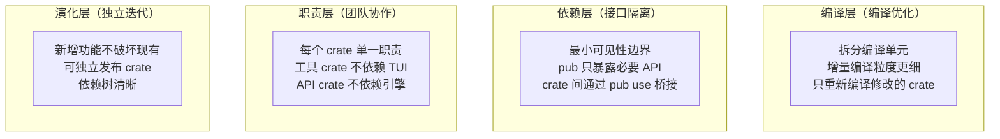
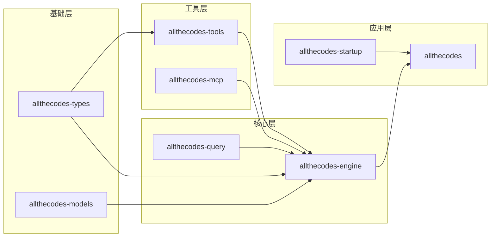

## TypeScript 原版的设计目标与其局限

Claude Code 的 TypeScript 实现（`claude-code-bun`）是一个设计精良的 agentic coding system，但其底层架构选择带来了一些系统性的工程挑战。allthecodes 并不是在批评前者的设计——恰恰相反，正是因为在长期跟进和深度使用中充分理解了这些限制，才决定用 Rust 走一条不同的路。

### 运行时依赖的问题

TypeScript 原版运行在 Bun 或 Node.js 之上，这个选择在开发效率上是巨大的优势——npm 生态丰富、开发迭代速度快、类型系统成熟。但从最终交付的角度看：

```
用户获得 Claude Code 的方式:
  npx @anthropic-ai/claude-code
  → 需要 Node.js >= 18 或 Bun
  → npm 解析依赖树
  → 下载数百个包到 node_modules
  → 解释执行

用户获得 allthecodes 的方式:
  wget / curl / brew install allthecodes
  → chmod +x
  → ./allthecodes
```

这种差异的根本原因是：**TypeScript 不是为分发单一可执行文件而设计的**。即使 Bun 提供了打包能力，其本质仍然是运行时 + 脚本的组合，而不是静态编译。

### 运行时开销

在 agentic coding system 的典型使用场景中，系统可能连续运行数小时，处理数千轮工具调用。V8 引擎在长时间运行中的表现：

| 指标 | Node.js/Bun (TS) | Rust (allthecodes) | 差异原因 |
|------|------------------|-------------------|---------|
| **冷启动时间** | 50-300ms | < 5ms | V8 引擎初始化 vs 原生代码直接执行 |
| **空闲内存** | 60-120MB | 5-15MB | V8 堆 + Node.js 核心模块 vs 直接分配 |
| **长时间运行内存增长** | 明显（GC 分代） | 稳定（所有权保证） | V8 GC 需要达到阈值才回收，Rust 编译时确定生命周期 |
| **上下文切换开销** | 中等 | 低 | Node.js 事件循环与 tokio async 运行时 |
| **子进程开销** | fork + exec 每启动一个 | 可预创建进程池 | Rust 有更多底层控制 |

### 类型系统的边界

TypeScript 的类型系统在运行时被擦除。这意味着：

```
// TypeScript: 编译后类型消失
interface Tool {
    name: string;
    call(input: unknown): Promise<ToolResult>;
}

// Rust: 类型在编译时 AND 运行时都存在
#[async_trait]
pub trait Tool: Send + Sync {
    fn name(&self) -> &str;
    fn input_schema(&self) -> serde_json::Value; // 运行时 JSON Schema
    async fn call(&self, input: serde_json::Value) -> Result<ToolResult>;
}
```

在 agentic coding system 中，工具系统需要将 Rust 类型转换为 JSON Schema 发送给 LLM，再解析 LLM 返回的 JSON 参数。TypeScript 无法直接生成 JSON Schema（需要 `ts-json-schema-generator` 等工具），而 Rust 的类型系统可以通过 `schemars` 等库直接从结构体定义生成 Schema。

## Rust 带来的架构优势

### 1. 静态二进制分发

单一静态二进制意味着：

- **无运行时依赖**：不需要用户安装 Node.js、Bun、Python 或任何解释器
- **跨平台分发简单**：为每个目标平台编译一次，用户下载即可运行
- **CI/CD 集成零摩擦**：在 Docker 容器中作为单一二进制复制，无需 `npm install`
- **版本管理简单**：不会出现全局包与本地包的版本冲突

### 2. 真正的并发控制

Node.js 的事件循环（event loop）模型本质上是单线程的并发模型。Rust 的 tokio 异步运行时提供了真正的多线程并发：

```rust
// Rust: 精确控制并行度
let handles: Vec<_> = tools_to_execute
    .into_iter()
    .map(|tool| {
        tokio::spawn(async move {
            tool.call(input).await
        })
    })
    .collect();

// 等待所有工具完成（真正的并行执行）
let results = futures::future::join_all(handles).await;
```

在 Node.js 中，`Promise.all()` 实现的并发是单线程的——I/O 操作可以并行，但 CPU 密集型操作会互相阻塞。Rust 的 `tokio::spawn` 会将任务分发到线程池中的多个线程。

### 3. 进程管理与沙箱

allthecodes 的 Shell 工具执行需要精确的进程控制能力：

```rust
// allthecodes 使用 tokio::process::Command + PTY 支持
use tokio::process::Command;

let mut child = Command::new("bash")
    .arg("-c")
    .arg(&command)
    // 精确的资源限制
    .stdout(std::process::Stdio::piped())
    .stderr(std::process::Stdio::piped())
    .kill_on_drop(true) // 父进程退出时自动终止
    .spawn()?;

// 超时控制
let result = tokio::time::timeout(
    Duration::from_secs(timeout_secs),
    child.wait_with_output()
).await;
```

Node.js 的 `child_process` 在高级进程控制方面存在限制——例如 PTY 支持、信号精确处理、进程组管理等方面不如 Rust 直接。`allthecodes-shell-command` crate 封装了完整的进程控制层，包括 PTY 分配、终端大小调整、退出信号链管理。

### 4. 错误处理

Rust 的错误处理模型（`Result<T, E>` + `?` 操作符）天然适合 agentic coding system 中复杂的错误传播场景：

```rust
// 清晰的错误传播：每个 ? 都携带类型信息
async fn execute_tool_chain(tools: Vec<Tool>) -> anyhow::Result<Vec<ToolResult>> {
    let mut results = Vec::new();
    for tool in tools {
        let input = tool.validate_input(input_json)?;  // ValidationError
        let permission = tool.check_permissions(&ctx)?; // PermissionError
        let result = tool.call(input).await?;           // ExecutionError
        results.push(result);
    }
    Ok(results)
}
```

相比于 TypeScript 的 `try/catch`（异常类型在运行时才能确定），Rust 的编译时错误检查确保所有错误路径都被显式处理。

### 5. FFI 与 Tree-sitter

allthecodes 使用 `tree-sitter` 进行代码解析（用于 AST 分析和代码搜索）：

```toml
# Cargo.toml 中直接使用 Tree-sitter
tree-sitter = "0.24"
tree-sitter-bash = "0.21"
```

在 TypeScript 中调用 Tree-sitter 需要通过 N-API 桥接（`tree-sitter` npm 包本质上是 C 扩展的 wrapper）。在 Rust 中，Tree-sitter 本身就是 C 库，Rust 的 FFI 调用是直接的、零开销的。

## 40-crate 的 Workspace 结构

allthecodes 使用 Cargo workspace 管理 40 个独立 crate。这种拆分方式远超常规 Rust 项目的 crate 数量，背后有其设计考量。

### 为什么会拆成 40 个 crate？



### 完整 crate 清单

| 分组 | crate | 职责 | 依赖关系 |
|------|-------|------|---------|
| **应用** | `allthecodes` | CLI 入口、TUI 界面、模式选择 | 依赖几乎所有 crate |
| **应用** | `allthecodes-startup` | 启动流程、快速路径、日志初始化 | 依赖 config/engine |
| **应用** | `allthecodes-bootstrap` | 进程状态初始化 | 独立 |
| **核心** | `allthecodes-engine` | QueryEngine、生命周期、提示词系统 | 依赖 types/query |
| **核心** | `allthecodes-query` | Agentic loop 实现 | 依赖 types |
| **工具** | `allthecodes-tools` | 工具注册、工具实现 | 依赖 types/mcp |
| **工具** | `allthecodes-mcp` | MCP 协议客户端 | 独立 |
| **工具** | `allthecodes-computer-use` | 桌面控制工具 | 独立 |
| **工具** | `allthecodes-safety` | Auto mode 安全分类器 | 依赖 types |
| **工具** | `allthecodes-sandbox` | 沙箱策略（网络隔离等） | 独立 |
| **工具** | `allthecodes-browser` | Chrome 集成 | 独立 |
| **工具** | `allthecodes-shell-command` | Shell 命令执行（PTY） | 独立 |
| **工具** | `allthecodes-lsp-service` | LSP 语言服务集成 | 依赖 types |
| **通信** | `allthecodes-api` | API 客户端、多 provider | 依赖 types/models |
| **通信** | `allthecodes-types` | 核心类型定义 | 无依赖（基础类型） |
| **通信** | `allthecodes-models` | 模型标识、别名、能力 | 独立 |
| **基础设施** | `allthecodes-config` | 配置加载、路径管理 | 独立 |
| **基础设施** | `allthecodes-auth` | API key、OAuth、Keychain | 独立 |
| **基础设施** | `allthecodes-permissions` | 权限决策、策略管理 | 依赖 types |
| **基础设施** | `allthecodes-observability` | 可观测性（审计日志） | 独立 |
| **基础设施** | `allthecodes-utils` | 工具函数 | 独立 |
| **基础设施** | `allthecodes-keybindings` | 键位绑定管理 | 独立 |
| **会话** | `allthecodes-session` | 会话持久化与恢复 | 依赖 types |
| **会话** | `allthecodes-skills` | 技能加载与执行 | 独立 |
| **会话** | `allthecodes-services` | 辅助服务（Langfuse 等） | 依赖 types |
| **会话** | `allthecodes-compact` | 上下文压缩 | 依赖 types |
| **扩展** | `allthecodes-plugins` | 插件发现与安装 | 独立 |
| **扩展** | `allthecodes-tasks` | 任务系统 | 依赖 types |
| **扩展** | `allthecodes-teams` | 团队协作功能 | 依赖 types |
| **扩展** | `allthecodes-gateway` | API 网关 | 依赖 types |
| **IPC** | `allthecodes-ipc` | IPC 入口（headless 运行） | 依赖 ipc-* |
| **IPC** | `allthecodes-ipc-protocol` | IPC 协议类型定义 | 独立 |
| **IPC** | `allthecodes-ipc-transport` | IPC 传输层（stdio/TCP/WS） | 依赖 protocol |
| **IPC** | `allthecodes-ipc-adapters` | IPC 适配层 | 依赖 protocol/engine |
| **IPC** | `allthecodes-ipc-client` | IPC 客户端 SDK | 依赖 protocol |
| **守护** | `allthecodes-daemon` | 后台守护进程 | 依赖 engine |
| **守护** | `allthecodes-voice` | 语音输入支持 | 独立 |
| **守护** | `allthecodes-web` | Web UI 服务 | 依赖 engine |
| **守护** | `allthecodes-worktree` | Git worktree 支持 | 独立 |

### Crate 拆分收益

**编译缓存粒度**：单一 crate 中修改一个文件会重新编译整个 crate。40 个 crate 意味着修改只影响一个 crate 的编译单元，增量编译缓存命中率更高。对于开发阶段的频繁修改，这可以显著减少等待编译的时间。

**接口契约强制**：crate 之间的可见性由 `pub` 关键字严格管控。一个 crate 只能访问另一个 crate 通过 `pub` 导出的内容。这种强制比 TypeScript 的模块边界更严格——没有 `export` 等于没有访问，不存在 TypeScript 中 `declare module` 绕过的可能性。

**职责边界清晰**：每个 crate 的 `Cargo.toml` 都明确声明了它的依赖关系。查看一个 crate 的依赖就能知道它应该做什么、不应该做什么。例如 `allthecodes-tools` 不依赖 `allthecodes-engine`，因为工具的 trait 定义是引擎消费的接口，而不是引擎的一部分。

### 依赖关系核心结构



## 与 Claude Code 生态的关系

allthecodes 定位为 Claude Code 的 Rust 实现，而不是替代品。两者的关系：

- **行为兼容**：所有核心用户交互体验与 Claude Code 对齐（消息提交、工具调用、权限对话框、会话管理）
- **架构独立**：不共享代码或 npm 包，是完全独立的 Rust 实现
- **路径隔离**：使用完全独立的持久化路径（`~/.allthecodes/`），可以与 Claude Code 共存
- **协议兼容**：Headless IPC 协议可被第三方前端消费

对于用户而言，选择 allthecodes 的理由：

```
你需要 allthecodes 如果:
  ✓ 希望在不需要 Node.js/Bun 的环境中运行 agentic coding assistant
  ✓ 需要极致启动速度（< 5ms cold start）
  ✓ 对内存占用敏感（如资源受限的开发环境、容器内使用）
  ✓ 希望单一二进制分发的便利性
  ✓ 偏好 Rust 生态的工具链管理

你不需要 allthecodes 如果:
  ✓ 已经深度嵌入 Claude Code 的 TypeScript 生态
  ✓ 需要官方 Anthropic 的支持和更新
  ✓ 需要最新功能的最快接入——TypeScript 版本的迭代速度通常更快
  ✓ 依赖特定的 npm 生态集成
```

## 项目路线

allthecodes 目前处于**全量构建**阶段，后续对齐方向：

1. **行为补齐**：持续与上游 Claude Code 的 TypeScript 分发版对齐行为
2. **性能优化**：进一步优化 agentic loop 的延迟和内存占用
3. **扩展生态**：插件系统接口稳定化，支持第三方工具和 provider 扩展
4. **稳定性提升**：增加集成测试覆盖，完善错误恢复和边界条件处理
5. **原生分发**：完善对更多平台的编译支持和二进制分发流程
