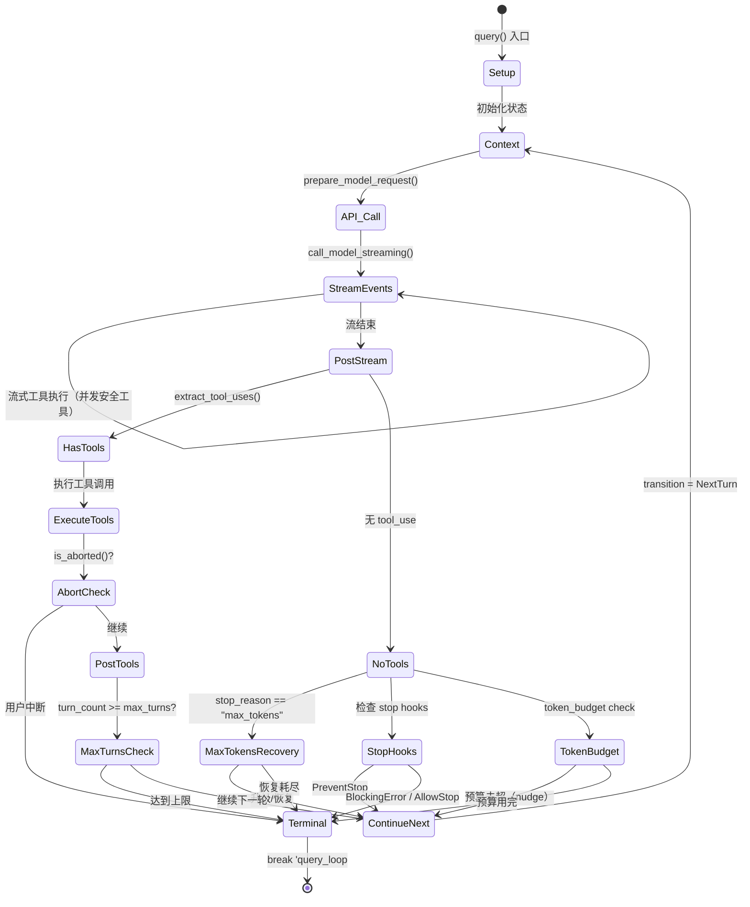

{/* 本章目标：基于 crates/allthecodes-engine/src/query/ 揭示 Agentic Loop 的完整状态机 */}

## 什么是 Agentic Loop

传统聊天机器人：你问一句，它答一句。
allthecodes 不一样：你说一个需求，它可能连续执行十几步操作才给你最终结果。

这背后的机制叫做 **Agentic Loop**（智能体循环），核心实现在 `crates/allthecodes-engine/src/query/loop_impl.rs` 的 `query()` 函数。它是一个 `'query_loop: loop { }` 无限循环，每次迭代代表一次"思考→行动→观察"周期。

## 循环的完整结构

`query()` 的每次迭代包含以下阶段：

### 阶段 1：初始化（Setup）

```
State 解构
  ├── turn_count 自增
  ├── 发送 QueryTurnStart 审计事件
  ├── 检查 abort 信号 → break
  └── 注入已完成的后台代理结果
       ├── 成功: "[Background agent '...' completed in Xs]"
       └── 失败: "[Background agent '...' failed after Xs]"
```

`turn_context.rs` 中的 `QueryRunContext` 维护会话期常量参数（system_prompt、max_turns、fallback_model、gates），而 `QueryLoopState` 在迭代间可变传递（messages、auto_compact_tracking、max_output_tokens_recovery_count 等）。

### 阶段 2：上下文预处理（Context Preprocessing）

`turn_context::prepare_model_request()` 实现上下文压缩管道：

```rust
// crates/allthecodes-engine/src/query/turn_context.rs
// prepare_model_request() 的处理流程
messages（当前对话）
  ↓ microcompact()    — 工具结果截断（微压缩）
  ↓ 发送 PreCompact Hook 事件
  ↓ refresh_tools()   — 刷新工具列表
  ↓ autocompact()     — 自动压缩（超出阈值时触发）
  ↓ 发送 PostCompact Hook 事件
messages（处理后的消息）→ 构建 ModelCallParams → 发往 API
```

关键设计：`autocompact` 请求包含 `max_output_tokens_override` 和 `thinking_enabled` 参数，支持 `advisor_model` 配置——这些参数在 `QueryLoopState` 迭代间累积（如 `max_output_tokens` 恢复后的提升值）。

### 阶段 3：流式 API 调用（Streaming with Fallback）

`deps.call_model_streaming()` 发起流式请求（`loop_impl.rs` 中内层 `loop`），支持模型降级（fallback）：

```rust
// loop_impl.rs — 流式调用循环（简化）
loop {
    yield RequestStartEvent;
    let stream_result = deps.call_model_streaming(attempt_params.clone()).await;
    // 流式事件消费 + accumulator 累加
    loop {
        let event_result = tokio::time::timeout(idle_timeout, event_stream.next()).await;
        match event_result {
            Ok(event) => {
                accumulator.process_event(&event);
                // ContentBlockStop → 流式工具执行器提前启动工具
                if let Some(tool_use) = accumulator.completed_tool_use(index) {
                    if let Some(executor) = streaming_tool_executor {
                        executor.add_tool_use(deps, tools, parent, callback, tool_use);
                    }
                }
                yield StreamEvent(event);
            }
            Err(_) => break with stream_error // 空闲超时
        }
    }
    // 流错误恢复 → 降级到 fallback 模型
    if let ModelCallFailureRecovery::Fallback { model } = classify(...) {
        strip_signature_blocks();  // 跨模型思维签名禁止回放
        attempt_params.model = Some(fallback);
        continue;  // 重试
    }
    break (assistant_message, streaming_tool_executor);
}
```

流式过程中的关键机制：
- **StreamAccumulator**（`crates/allthecodes-api/src/api/streaming.rs`）：SSE 事件累积器，逐步构建 `AssistantMessage`
- **空闲超时**（`STREAM_IDLE_TIMEOUT`）：默认 120 秒（测试 50ms），无事件则终止
- **停滞检测**（`STREAM_STALL_TIMEOUT`）：默认 60 秒（测试 25ms），无进度事件则终止
- **超时时长**可通过 `ALLTHECODES_STREAM_IDLE_TIMEOUT_MS` / `ALLTHECODES_STREAM_STALL_TIMEOUT_MS` 环境变量覆盖
- **流式工具执行**（`StreamingToolExecutor`）：在流式阶段并行启动 concurrency-safe 工具

### 阶段 4：后处理（Post-Streaming）

```
检查 abort → yield observable assistant → break
注入 pending_tool_use_summary（system message）
yield AssistantMessage → push 到 state.messages
```

`backfill_observable_tool_inputs()` 会为 tool_use block 回填可观察字段（如文件路径展开），但只在添加了**新字段**时才克隆消息，避免破坏 prompt cache 的字节一致性。

### 阶段 5 vs 6：分支——无工具调用或执行工具

```rust
let tool_uses = extract_tool_uses(&assistant_message);

if tool_uses.is_empty() {
    // 阶段 5：终止检查
} else {
    // 阶段 6：工具执行
}
```

## 终止条件

| 终止原因 | 触发位置 | 机制 |
|----------|---------|------|
| **aborted** | Step 3 前/后 | `deps.is_aborted()` → yield abort message → break |
| **prompt_too_long** | 流式调用错误 | 两步恢复（collapse_drain → reactive_compact）失败 → break |
| **model_error** | 流式调用错误 | 不可恢复且无 fallback → yield error message → break |
| **stream_error** | 流式中断 | 空闲超时/停滞超时且无 fallback → yield error message → break |
| **max_output_tokens** | Step 5a | 三步恢复（escalate → recovery_msg）耗尽 → break |
| **stop_hook_blocking** | Step 5b | Stop hook error → break |
| **token_budget** | Step 5c | 预算用完 → break |
| **hook_stopped** | Step 6b | 工具执行中 hook 阻断 → break |
| **max_turns** | Step 8 | `turn_count >= max_turns` → break |
| **completed** | 默认 | `needsFollowUp = false` → 经过 stop hooks → break |

## 继续条件（恢复路径）

### 1. 正常工具循环（`next_turn`）
有 tool_use → 执行工具 → 新消息追加到 `state.messages` → `continue`

### 2. max_output_tokens 恢复（`max_output_tokens_escalate` / `max_output_tokens_recovery`）
- **提升阶段**：首次截断时，将 `max_output_tokens_override` 从 None 提升到 `ESCALATED_MAX_TOKENS`（64K），静默重试
- **恢复阶段**：注入恢复消息 "continue from where you left off"，最多重试 `MAX_OUTPUT_TOKENS_RECOVERY_LIMIT = 3` 次

### 3. Prompt-Too-Long 恢复（`collapse_drain_retry` / `reactive_compact_retry`）
- **Collapse Drain**：先尝试提交折叠释放空间，`has_attempted_collapse_drain` 防无限循环
- **Reactive Compact**：collapse 无效则触发紧急压缩，`has_attempted_reactive_compact` 防无限循环

### 4. Stop Hook 阻塞重试（`stop_hook_blocking`）
Stop hook 注入阻塞消息 → 追加到对话 → `continue`

### 5. Token Budget 继续（`token_budget_continuation`）
预算未超阈值 → 注入 nudge 消息 → `continue`。`diminishing_returns` 检测收益递减（连续 3 轮增量 < 500 tokens）→ 提前终止

## 模型降级（Fallback）

当主模型不可用时（`classify_model_call_failure` 返回 `Fallback { model }`）：

1. **请求开始失败**：直接切换到 fallback，重试
2. **流式中断失败**：已收到的 assistant 消息被 tombstone，strip 思维签名块后重试（`strip_fallback_signature_blocks` 移除 Thinking/RedactedThinking/ConnectorText）
3. 降级检测基于错误字符串：`529`、`overloaded`、`high demand`、`capacity`

## 状态机：QueryLoopState 对象

```rust
// crates/allthecodes-engine/src/query/turn_context.rs（间接）
// 对应 TypeScript State 类型
struct QueryLoopState {
    messages: Vec<Message>,
    auto_compact_tracking: Option<AutoCompactTracking>,
    max_output_tokens_recovery_count: usize,
    has_attempted_reactive_compact: bool,
    has_attempted_collapse_drain: bool,
    max_output_tokens_override: Option<usize>,
    pending_tool_use_summary: Option<String>,
    stop_hook_active: Option<bool>,
    turn_count: usize,
    transition: Option<Continue>,
}
```

每次 `continue` 都创建新的 State 对象（`let mut state` 在 loop 外部，通过可变引用修改）。`transition` 字段记录了为什么继续——让后续迭代能检测特定恢复路径（如 `collapse_drain_retry`）避免循环。

## 流式工具执行（StreamingToolExecutor）

allthecodes 在流式接收事件过程中就能开始执行工具，不等流结束：

```rust
// loop_helpers.rs — StreamingToolExecutor
struct StreamingToolExecutor {
    started: Vec<StartedStreamingTool>,
    blocked_by_serial_tool: bool,
}

// ContentBlockStop 事件到达时：
// 1. 检查工具是否 concurrency_safe
// 2. 如果是 → tokio::spawn 立即启动执行
// 3. 如果遇到 serial 工具 → blocked_by_serial_tool = true，后续工具排队
```

流式执行完成后，`finish().await` 收集所有已完成工具的结果，未启动的工具通过 `execute_tool_calls()` 执行。最终通过 `merge_tool_results_by_tool_use_order()` 按原始 tool_use 顺序合并结果。

## 工具执行批处理

`execute_tool_calls()` 按 concurrency_safe 属性分区执行：

```
工具列表: [Read(并发安全), Glob(并发安全), Bash(串行), Read(并发安全)]
  ↓ 分区
批次 1 (并发): [Read, Glob]  → tokio::spawn 并行执行
批次 2 (串行): [Bash]        → 顺序执行
批次 3 (串行): [Read]        → 顺序执行（因为前一个 Bash 是串行）
```

Langfuse 跟踪：并发批次创建 `tool_batch_span`，串行执行各自独立。

## 为什么不是"一次规划，批量执行"

源码揭示了为什么 allthecodes 选择逐步循环：

- **每一步都产生真实信息**：`execute_tool()` 返回的 `ToolResult` 包含 `data`、`model_content`、`new_messages`——这些是 API 不可能预知的
- **动态上下文管理**：每轮迭代前都重新评估压缩需求（microcompact → autocompact），基于最新的消息长度
- **错误即时恢复**：工具失败不需要推倒重来——stop hook 可以注入阻塞错误让 AI 修正策略
- **用户可控**：`deps.is_aborted()` 在循环的多个检查点被检测，用户按 ESC 可以优雅中断
- **成本控制**：`calculate_cost()` 在每次流结束后计算费用，`BudgetTracker` 防止 AI 无效循环

## 一个完整的迭代示例

```rust
迭代 1: 思考→行动
  预处理: microcompact → autocompact → 上下文很短，无需压缩
  API 调用: 返回 tool_use(Glob, "**/*.ts")
  工具执行: 并行 Glob → 返回 42 个文件路径
  → transition: NextTurn, continue

迭代 2: 思考→行动
  预处理: 42 个文件结果仍在预算内
  API 调用: 返回 tool_use(Grep, "import.*from")
  工具执行: 在 15 个文件中找到 120 条 import
  → transition: NextTurn, continue

迭代 3: 思考→行动
  预处理: 120 条 Grep 结果触发 microcompact → 摘要化
  API 调用: 返回 3 个 tool_use(FileEdit, ...)
  工具执行: 删除 5 条未使用导入
  → transition: NextTurn, continue

迭代 4: 总结
  API 调用: 返回纯文本 "已清理 3 个文件中的 5 条未使用导入"
  → 无 tool_use → stop hooks 通过 → token budget 检查通过
  → break（循环终止）
```


