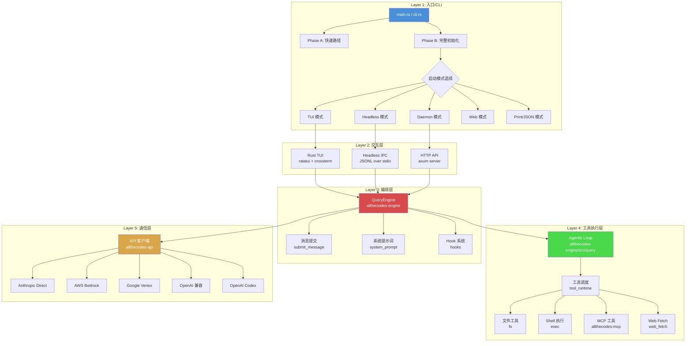
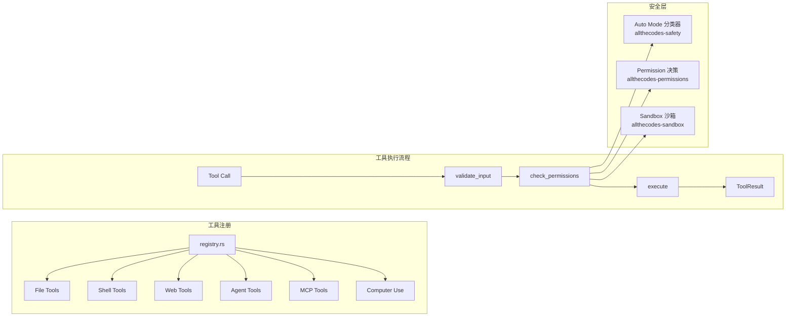
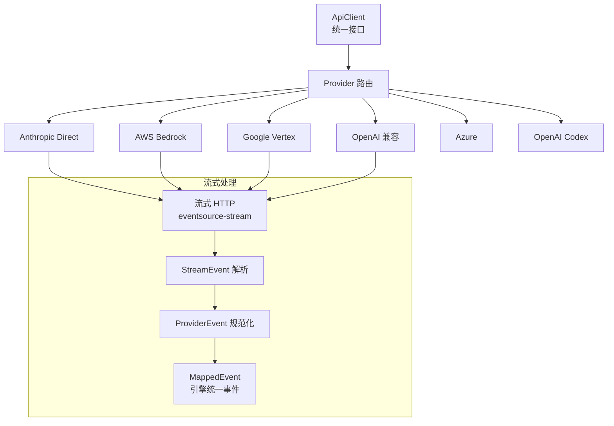

## 五层架构总览

allthecodes 从上到下分为五个层次，每一层职责清晰、边界分明。这种分层与 Claude Code 原版一脉相承，但在 Rust 实现中每个层级的模块边界更加严格（通过 crate 级别的可见性控制）。



| 层次 | 职责 | 核心 crate | 关键词 |
|------|------|-----------|--------|
| **Layer 1** | 参数解析、快速路径、模式选择 | `allthecodes`, `allthecodes-startup` | Phase A, Phase B, bootstrap |
| **Layer 2** | 终端 UI、用户输入、消息展示 | `allthecodes/src/ui/`, `allthecodes-ipc` | ratatui, crossterm, headless |
| **Layer 3** | 会话管理、生命周期、提示词 | `allthecodes-engine` | QueryEngine, lifecycle |
| **Layer 4** | Agentic loop、工具调度、MCP | `allthecodes-engine::query`, `allthecodes-tools`, `allthecodes-mcp` | agentic loop, tool exec |
| **Layer 5** | API 客户端、多 provider、流式 | `allthecodes-api` | streaming, provider, retry |

## Layer 1: 入口/CLI 层

入口层负责进程启动、参数解析和运行模式选择，对应 `main.rs` 和 `cli.rs`。

### 三阶段生命周期

main.rs 中的执行流程分为三个阶段：

```
Phase A (同步): Cli::parse() → 快速路径检查
  ├── --version              → 输出版本号退出
  ├── --chrome-native-host   → Chrome 原生消息桥接
  ├── --dump-system-prompt   → 打印系统提示词退出
  ├── --export-ui-snapshots  → 导出 TUI 截图
  └── --daemon-worker        → 守护进程 worker 模式

Phase B (异步, run_full_init()):
  1. 切换工作目录（--cwd）
  2. 首次运行初始化（settings.json 模板写入）
  3. 加载分层设置（managed → user → project → local → env → CLI）
  4. 权限模式解析（auto / acd / bypass）
  5. 插件初始化 → 工具注册 → Skills 加载
  6. MCP 服务器发现与连接
  7. Chrome / Computer Use 可选用集成
  8. 模型选择（CLI arg → config → provider default → 硬编码默认）
  9. 会话恢复（--resume / --continue）
  10. 创建 QueryEngine
  11. 选择运行模式

Phase I (关闭): graceful_shutdown() → 子进程清理 → 持久化
```

### 模式选择

```
TUI 模式     → crates/allthecodes/src/ui/tui.rs       [默认]
Headless 模式 → allthecodes-ipc::headless::run_headless()
Daemon 模式   → allthecodes-daemon::server::serve_http()
Web 模式      → allthecodes-web::start_server()
Print 模式    → startup::modes::run_print_mode()
JSON 模式     → startup::modes::run_json_mode()
```

### CLI 参数结构

`cli.rs` 使用 clap 派生宏定义完整的 CLI 参数集，包含 20+ 参数：

| 参数 | 类型 | 用途 |
|------|------|------|
| `-V, --version` | 标志 | 输出版本号（快速路径） |
| `-p, --print` | 标志 | 非交互式单次问答 |
| `--resume` | 标志 | 恢复最近会话 |
| `--continue` | 可选字符串 | 恢复指定会话 ID |
| `--max-turns` | 可选数字 | Agentic loop 最大轮次 |
| `-C, --cwd` | 可选字符串 | 工作目录覆盖 |
| `-m, --model` | 可选字符串 | 模型覆盖 |
| `--system-prompt` | 可选字符串 | 自定义系统提示词 |
| `--permission-mode` | 可选字符串 | 权限模式（auto/acd/bypass） |
| `--headless` | 标志 | 无 TUI，JSONL IPC 通信 |
| `--daemon` | 标志 | 后台守护进程模式 |
| `--web` | 标志 | Web UI 模式 |
| `--computer-use` | 标志 | 启用桌面控制工具 |
| `--chrome` / `--no-chrome` | 标志 | Chrome 集成开关 |
| `--no-network` | 标志 | 禁用网络访问（沙箱策略） |

## Layer 2: 交互层

交互层是用户与 AI 系统之间的界面层。allthecodes 支持多种交互模式。

### Rust TUI（默认模式）

基于 ratatui（终端 UI 框架）+ crossterm（终端控制）构建的即时模式渲染界面。目录结构：

```
crates/allthecodes/src/ui/
├── tui.rs              # TUI 主循环（事件 → 更新 → 渲染）
├── app.rs              # 应用状态管理
├── app/                # 子组件 (chat, status 等)
├── components/         # 可复用组件 (markdown, input 等)
├── messages.rs         # 消息列表渲染
├── rendering/          # 自定义渲染器
├── theme/              # 主题系统
├── prompt_input.rs     # Prompt 输入组件
├── permissions.rs      # 权限对话框
├── diff.rs             # Diff 可视化
└── hooks/              # UI Hook 系统
```

TUI 主循环遵循即时模式渲染范式：`poll_event() → handle_event() → update_state() → render()`。每个 tick 都重新渲染整个界面，而非像 React/Ink 那样维护虚拟 DOM diff。渲染性能由 Rust 的编译优化保证。

TUI 支持的功能包括：markdown 渲染、语法高亮（syntect）、分屏面板、多主题、键位绑定、权限对话框、diff 可视化、通知系统、命令面板、状态栏、LSP 推荐等。

### Headless IPC 模式

通过 `--headless` 启用，使 allthecodes 在没有 TUI 的情况下运行，通过标准输入输出以 JSONL 格式通信。IPC 栈当前按协议 crate、运行时 IPC crate 和 Web/API 协议 crate 分工：

| crate | 职责 |
|-------|------|
| `allthecodes-ipc-protocol` | 协议类型定义（事件枚举、序列化） |
| `allthecodes-ipc` | 运行时 IPC crate，包含 JSONL stdio、transport、adapter、client/helper、subsystem handler facade 等合并后的实现 |
| `allthecodes-protocol` | Web/API 协议定义、endpoint metadata、路由/代码生成基础 |

```jsonl
// 客户端 → allthecodes
{"type":"user_message","text":"帮我修复这个 bug"}
// allthecodes → 客户端
{"type":"stream_event","event":{"type":"text","text":"让我看看代码..."}}
{"type":"tool_use","name":"Read","input":{"file_path":"src/main.rs"}}
```

### Daemon & Web 模式

- **Daemon**（`--daemon`）：基于 axum HTTP 服务器，支持后台运行、团队记忆（Team Memory）、GitHub PR 活动路由、定时 tick 循环（KAIROS 模式）
- **Web**（`--web`）：启动后端 HTTP/API/WS 服务；npm release 默认不内嵌 sibling `allthecodes-web` SPA，浏览器前端应由独立 Web 仓库连接该后端

## Layer 3: 编排层（QueryEngine）

编排层是 allthecodes 的核心大脑，实现为 `allthecodes-engine` crate。QueryEngine 管理整个 agent 会话的生命周期。

### 模块结构概览

```
allthecodes-engine/src/
├── lifecycle/              # QueryEngine 生命周期
│   ├── mod.rs              # QueryEngine 结构体定义
│   ├── types.rs            # 配置与状态类型
│   ├── submit_message/     # 消息提交流程（主流程、命令处理、记忆召回、流处理、提示词构建）
│   └── deps/               # 子依赖（autocompact、execute、model_call、permission）
├── query/                  # Agentic loop（loop_impl、loop_helpers、turn_context、token_budget）
├── system_prompt/          # 系统提示词（static_sections + dynamic_sections）
├── agent/                  # 子 agent 系统（dispatch、fork、supervisor、worktree）
├── types/                  # 核心类型定义
├── tool_runtime/           # 工具执行框架
└── hooks/                  # Hook 系统（agent_hook、prompt_hook、session_hooks）
```

### QueryEngine 生命周期状态机

```mermaid
stateDiagram-v2
    [*] --> Created: QueryEngine::new()
    Created --> Ready: update_app_state()

    Ready --> Submitting: query() / submit_message()
    Submitting --> BuildingPrompt: 构建系统提示词
    BuildingPrompt --> CallingModel: 调用 API
    CallingModel --> StreamingResponse: 流式响应
    StreamingResponse --> ExecutingTools: 检测 tool_use
    ExecutingTools --> CallingModel: 发送工具结果
    ExecutingTools --> Completed: 任务完成
    CallingModel --> Completed: AI 最终回复
    Completed --> Submitting: 用户新消息
    Ready --> Shutdown: graceful_shutdown()
    Shutdown --> [*]
```

### submit_message 核心流程

`submit_message()` 是 QueryEngine 的核心方法，负责处理用户输入的完整生命周期：

```
用户输入
  │
  ├─ 1. 命令检测：是否为斜杠命令（/model, /compact, /skill 等）？
  │     是 → command_handling.rs 处理
  │
  ├─ 2. 记忆召回：检查 session memory，注入相关上下文
  │
  ├─ 3. 系统提示词构建：动态组装静态段 + 动态段
  │     ├── 静态段：角色定义、工具定义、输出格式
  │     └── 动态段：CLAUDE.md、git diff、MCP 服务器列表、日期时间
  │
  ├─ 4. 流式 API 调用：deps/model_call.rs → stream_handler.rs
  │
  ├─ 5. 工具执行：检测 tool_use → tool_runtime 执行 → 结果回传
  │
  ├─ 6. 上下文压缩：检查 token 预算 → autocompact 触发
  │     ├── apply_tool_result_budget: 裁剪工具结果
  │     ├── snip_compact: 摘要非关键消息
  │     └── autocompact: 替代为结构化摘要
  │
  └─ 7. 继续/终止判定：stop_reason → end_turn / needs_follow_up
```

## Layer 4: 工具执行层

工具执行层包括 Agentic Loop 和工具系统两大部分。

### Agentic Loop（allthecodes-engine::query）

当前 query loop 由 `allthecodes-engine/src/query/` 持有。历史上的独立 `allthecodes-query` crate 已删除，避免 engine 主路径与独立 query loop 产生行为漂移。循环本身仍是一个 `AsyncGenerator` 风格的流式 agentic loop：

```
loop {
    // 1. 上下文预处理
    apply_tool_result_budget → snip_compact → context_collapse → autocompact

    // 2. 流式 API 调用
    call_model() → AsyncGenerator<StreamEvent | Message>

    // 3. 收集 assistantMessages 和 toolUseBlocks

    // 4. 工具执行（StreamingToolExecutor 并行 或 runTools 串行）
    execute_tools(tool_blocks) → tool_results[]

    // 5. 继续/终止判定
    needs_follow_up ? continue : return { reason }
}
```

Loop 状态通过 `State` 结构体在迭代间传递：

| State 字段 | 用途 |
|-----------|------|
| `messages` | 完整消息历史（包含工具结果） |
| `auto_compact_tracking` | 自动压缩追踪（避免重复压缩同一段） |
| `max_output_tokens_recovery_count` | Token 配额恢复计数 |
| `token_budget` | 当前轮次 token 预算 |
| `turn_context` | 当前轮次上下文信息 |

### 工具系统（allthecodes-tools）

`allthecodes-tools` crate 管理 50+ 工具的注册、调度和执行。



工具分类：

| 工具类别 | 示例 | crate |
|---------|------|-------|
| 文件工具 | `Read`, `Write`, `Edit`, `Glob`, `Grep` | `allthecodes-tools::fs` |
| Shell 工具 | `Bash`, `BashInteractive` | `allthecodes-tools::exec` |
| Web 工具 | `WebFetch`, `WebSearch` | `allthecodes-tools::web_fetch` |
| Agent 工具 | `Agent`, `AgentDelegate` | `allthecodes-tools` + `allthecodes-engine::agent` |
| MCP 工具 | 由 MCP 服务器动态暴露 | `allthecodes-mcp` |
| Computer Use | `Screenshot`, `MouseMove`, `Type`, `Key` | `allthecodes-computer-use` |
| 查询工具 | `AskUser`, `SendUserMessage` | `allthecodes-tools` |
| 规划工具 | `PlanMode`, `Brief` | `allthecodes-tools::plan_mode` |

每个工具实现 `Tool` trait，核心方法链：`validate_input() → check_permissions() → call() → ToolResult`。

### MCP 工具集成

MCP（Model Context Protocol）服务器通过 `allthecodes-mcp` crate 集成：

- **服务器发现**：扫描配置文件和项目目录中的 MCP 服务器定义
- **连接管理**：`McpManager` 管理多个服务器的生命周期（启动、连接、健康检查）
- **工具适配**：`mcp_tool_adapter` 将 MCP 工具定义包装为统一的 `Tool` trait 实现
- **技能映射**：MCP 服务器可提供技能资源，通过 `discover_mcp_skill_resources()` 集成到技能系统
- **Chrome 桥接**：支持 `--chrome` 模式下注册 `claude-in-chrome` 作为第一方 MCP 服务器

## Layer 5: 通信层

`allthecodes-api` crate 负责与各种 AI 模型提供商的流式通信。

### Provider 架构



### 支持的 Provider

| Provider | 模块 | 认证方式 | 特殊功能 |
|---------|------|---------|---------|
| Anthropic Direct | `client/provider.rs` | `ANTHROPIC_API_KEY` | Prompt caching, thinking |
| AWS Bedrock | `bedrock.rs` | AWS SigV4 | IAM 认证 |
| Google Vertex | `vertex.rs`, `google_provider.rs` | GCP 服务账号 | 区域部署 |
| OpenAI 兼容 | `openai_compat/` | `OPENAI_API_KEY` | 通用兼容层 |
| Azure | `client/provider.rs` | `AZURE_API_KEY` | Azure 部署 |
| OpenAI Codex | `openai_compat/codex.rs` | `OPENAI_CODEX_AUTH_TOKEN` | Codex CLI 兼容 |

所有 API 通信都是流式的——`call_model()` 返回 `AsyncGenerator<StreamEvent>`，用户看到 AI "逐字打出"回答。流式管道：SSE bytes → `StreamEvent` 解析 → `ProviderEvent` 规范化 → `MappedEvent`（引擎统一事件格式）。

### 数据流全景

```mermaid
sequenceDiagram
    participant User
    participant CLI as Layer 1: CLI
    participant TUI as Layer 2: TUI
    participant QE as Layer 3: QueryEngine
    participant Loop as Layer 4: Agentic Loop
    participant Tools as Layer 4: Tools
    participant API as Layer 5: API

    User->>CLI: ./allthecodes
    CLI->>CLI: Phase A + Phase B 初始化
    CLI->>TUI: 启动 TUI

    User->>TUI: 输入消息
    TUI->>QE: submit_message()
    QE->>QE: 构建系统提示词
    QE->>API: call_model()

    loop Agentic Loop
        API-->>QE: 流式事件
        QE-->>TUI: 渲染响应

        alt 工具调用
            QE->>Loop: 检测 tool_use
            Loop->>Tools: execute_tools()
            Tools-->>Loop: ToolResults
            Loop->>API: 发送工具结果
            API-->>QE: 继续响应
        else 最终回复
            QE-->>TUI: 完成消息
            TUI-->>User: 显示回复
        end
    end
```

## Crate 依赖关系

当前 workspace 约 42 个 crate 按职责分组，依赖关系以“基础类型/协议 → domain/service → runtime → UI/binary glue”为方向。近期结构收敛已合并过小 re-export crate：IPC transport/client/adapters 已进入 `allthecodes-ipc`，模型/pricing 元数据已进入 `allthecodes-types::models`，query loop 已进入 `allthecodes-engine/src/query`。

```mermaid
graph TD
    subgraph "应用层"
        A[allthecodes<br/>CLI + TUI]
        S[startup]
    end
    subgraph "核心"
        E[engine<br/>含 query loop]
    end
    subgraph "工具"
        T[tools] --> M[mcp]
        T --> CU[computer-use]
        T --> SF[safety]
        T --> SB[sandbox]
        TD[tool-display]
    end
    subgraph "API"
        API[api] --> MD[types::models]
    end
    subgraph "基础"
        CF[config]  AU[auth]  TP[types]
        UT[utils]   KP[keybindings]  OB[observability]
    end
    subgraph "会话"
        SN[session]  SK[skills]  SV[services]
    end
    subgraph "扩展"
        PL[plugins]  BR[browser]  LS[lsp-service]
        TK[tasks]    TM[teams]
    end
    subgraph "IPC & 守护"
        IP[ipc + ipc-protocol]  DM[daemon]  VO[voice]
        WB[web]      WT[worktree]
    end

    A --> E & S
    E --> T & API & CF & AU & TP & UT
    E --> SN & SK & SV & PL & BR & LS & TK & TM & VO & WB & WT
    T --> M & CU & SF & SB
    TD --> TP
    API --> MD
    A --> IP & DM
```

## Development 状态汇总

根据 `development/` 下的当前状态文档和完成记录，项目完成度可以概括为：

| 领域 | 当前完成信息 |
| --- | --- |
| Runtime execution record | 已完成。`AgentRuntimeExecutionRecord` 稳定输出 session、agent、tool、shell digest、retry/fallback、model、permission decision 等字段，并进入 headless、dashboard NDJSON、normalized IPC 和 Web IPC replay/bridge；当前不是写入 SQLite 表。 |
| 会话管理 | 已形成运行时闭环。新写入优先走共享 SQLite 状态库，同时保留 `~/.allthecodes/sessions/*.json` 兼容快照；支持恢复、继续、归档、分支、导出和 record/replay 事件。 |
| 工具发现 | 已形成分层注册体系。内置工具、root-owned 工具、MCP、插件、技能、deferred tools 和 ToolSearch 共同组成 runtime tool catalog。 |
| 权限治理 | 已集中到 `allthecodes-permissions` 决策引擎，覆盖 permission mode、规则、hook、auto review/classifier、dangerous command、路径边界、Plan mode、sandbox allowed commands 和 TUI/Web 授权。 |
| MCP HTTP/OAuth | 已完成。支持 Streamable HTTP、HTTP header/bearer/OAuth 鉴权、session recovery、手动与 loopback OAuth、token store mode、CLI/IPC/Web REST OAuth 控制面。 |
| MCP scope isolation | 已实现。支持 global/project/session/thread binding；engine、agent、skill fork 按 context 过滤 MCP tools，并在 MCP tool call 前做权限二次校验。 |
| Worktree-aware session | 已实现。`WorktreeSessionRecord`、SQLite store、migration、Enter/ExitWorktree、Agent isolation、orphan reconciliation 和 Web/API 查询已落地。 |
| TUI semantic operation | 已完成主计划。`allthecodes-tool-display` 共享 classifier、operation row/batch、verbose raw mode、TodoWrite checklist、result summary 和 Always Allow 链路已接入。 |
| Cost/session usage | 已实现当前计划。runtime/session/Web usage 可用，session cost log 计划标记 Implemented；per-tool/per-agent 精细归因仍是后续统一 ledger 方向。 |
| Web API gap | Usage、Memory、Files、Skills、Backend Services、Jobs/Cron、Kanban、Group Chat 当前不再是 gap；Gateway 与 Logs/Diagnostics 已有 handler work。 |

仍需重点收敛的边界：

1. 工具执行边界仍过宽：`execute_tool_impl` 一类路径同时承担 validation、hook、permission、sandbox、tool call、post hook、audit、Langfuse、runtime record，后续要收敛为 `ToolExecutionPlan` / `ToolExecutionPipeline`。
2. Query/submit 生命周期仍需状态机化：目标是拆出 `QueryTurnState`、恢复策略模块和 `SubmitTransaction`，让 query 产出 typed turn events，submit 消费事件并提交 side effects。
3. Session/record-replay 真相源仍在迁移：当前 SQLite、legacy JSON 和 record/replay JSONL 并存；方向是 JSONL transcript truth + SQLite index/query cache + legacy JSON 兼容输入。
4. API/IPC dispatcher 仍有 legacy adapter：`allthecodes-protocol` 已提供基础，但完整 dispatcher、WebSocket IPC 和传输层抽象仍需继续接入。
5. Hook 系统需要补齐行为矩阵：Full Build 阶段不能保留静默 success placeholder；未实现项要显式记录为 intentional gap。
6. MCP bridge dependency health 仍是计划状态，不是已完成项；需要补 proof-of-life/probe、错误分类、重试/circuit breaker 和 UI/IPC 状态面。


## 四个核心设计原则

### 1. 流式优先（Streaming-first）

所有 API 通信都是流式的——`call_model()` 返回 `AsyncGenerator<StreamEvent>`，用户看到 AI "逐字打出"回答。工具执行也支持流式模式（`StreamingToolExecutor`），在流式过程中就开始并行执行工具。模型降级（Fallback）时，已收集的 assistantMessages 被标记为 tombstone 并清空，重试整个流式请求。

### 2. 工具即能力（Tool as Capability）

每个工具是 `Tool` trait 的结构化实现，通过工厂函数创建。`get_all_tools()` 在每次 API 调用时重新组装（非全局缓存），因为 `is_enabled()` 可能随运行时状态变化。MCP 工具通过适配器模式无缝集成，工具调用经过 `validateInput() → canUseTool() → checkPermissions() → call()` 完整链路。

### 3. 权限即边界（Permission as Boundary）

每次工具调用经过 `validate_input() → check_permissions()` 双重检查。权限规则从多个来源汇聚（session → project → user → managed → default），支持工具名、命令模式、路径前缀等匹配方式。Auto Mode 通过 `allthecodes-safety` 分类器做实时风险评估，高风险操作自动提示用户确认。

### 4. 上下文即记忆（Context as Memory）

System Prompt 动态组装，包含 CLAUDE.md、git 状态、当前日期、MCP 服务器列表、可用工具定义等。Autocompact 在每轮迭代前评估 token 阈值，超出时触发结构化压缩管道：`applyToolResultBudget → snipCompact → microcompact → contextCollapse → autocompact`。压缩后的摘要替换原始消息，`taskBudgetRemaining` 跨压缩边界累计。
